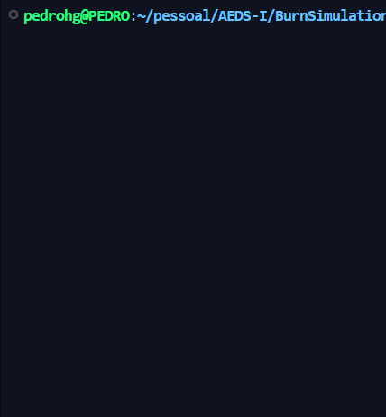

 
     

 

🖤 Burn Simulation

☕ Introdução

Este projeto foi desenvolvido para a disciplina de Algoritmos e Estruturas de Dados I, ministrada pelo professor Michel Pires Silva, no Centro Federal de Educação Tecnológica de Minas Gerais (CEFET-MG) — Campus V - Divinópolis.

O objetivo do trabalho é simular a propagação de um incêndio em uma floresta modelada como uma matriz N x M (mínimo de 100x100), além de implementar uma lógica de movimentação inteligente para um animal que tenta escapar do fogo.
🎯 Objetivos

    Simular, de forma visual e/ou em arquivo, a propagação de incêndios numa floresta representada por uma matriz.

    Implementar regras realistas de propagação, considerando influência de vento e ciclos de queima.

    Modelar o comportamento de um animal que tenta fugir do fogo.

    Registrar estatísticas relevantes: passos dados, vezes que encontrou água e situação final.

    Utilizar conceitos de estruturas de dados e algoritmos eficientes, como Busca em Largura (BFS) e filas.

Regras do Incêndio:

    Uma árvore saudável (1) pega fogo se possuir vizinho em chamas (2).

    Uma árvore em chamas (2) se torna queimada (3) no ciclo seguinte.

    O fogo se propaga ortogonalmente.

    O vento pode alterar as direções de propagação, conforme configurado.

    A simulação termina quando o fogo apaga ou o número máximo de iterações é atingido.

Regras do Animal:

    Prioriza movimentação para Água (4).

    Evita áreas queimadas (3).

    Quando encontra água, restaura o ambiente ao redor.

    Movimenta-se antes da propagação do fogo.

    Caso fique cercado, tenta fugir numa "última chance".

🖥️ Ambiente de Criação

    Linguagem: C++

    Sistema Operacional: WSL Ubuntu (ex: Ubuntu 22.04)

    Compilador: (adicione aqui sua versão, ex: g++ 11.4.0)

📂 Organização dos Arquivos

.
├── include/
│   ├── Matriz.hpp
│   ├── Incendio.hpp
│   ├── Animal.hpp
│   └── Config.hpp
├── src/
│   ├── Matriz.cpp
│   ├── Incendio.cpp
│   ├── Animal.cpp
│   └── main.cpp
├── build/
│   └── (arquivos gerados após compilação)
├── Makefile
└── README.md

💡 Implementação
Estruturas de Dados

    Fila (Queue) — utilizada na propagação do fogo (BFS) para garantir que o fogo se espalhe uniformemente.

    Matriz (2D Vector) — representa o mapa da floresta e armazena os estados das células.

    Justificativa: a BFS é ideal para simular expansões controladas em grades, sendo eficiente tanto em desempenho quanto em clareza lógica.

Funções

    void Simular()
    Simula a propagação do fogo e a movimentação do animal, gerando como saída um arquivo output.dat contendo logs e mapas.

    void SimularTerminal()
    Simula o mesmo processo, mas exibe os mapas diretamente no terminal com efeito de animação.

    animal.movimentaAnimal()
    Calcula o próximo movimento seguro para o animal, priorizando água e caminhos não bloqueados.

📜 Arquivos Adicionais

    Makefile: Automatiza a compilação, limpeza de build e execução.

🧪 Casos de Teste

Exemplo de entrada:

    Matriz inicial com árvores e algumas células de água.

    Incêndio inicial em posições fixas.

Exemplo de saída esperada:

Iteração 1:
Animal se moveu para (X, Y)
Posições queimadas: [(a, b), (c, d)]

Ao final:

Total de passos: 25
Vezes que achou água: 3
Estado do animal: Vivo

🤔 Curiosidades / Observações

    O animal pode "sentir" o perigo do fogo e receber uma segunda chance ao ser cercado.

    Áreas atingidas pela água se regeneram automaticamente, reforçando a noção de "segurança" ambiental.

👨🏻‍🔬 Ambiente de Teste

    Sistema Operacional: WSL Ubuntu (versão a ser especificada)

    Compilador: (adicione sua versão exata do g++)

    Hardware: (adicione detalhes se desejar, por exemplo: i5, 8GB RAM)

👨🏻‍💻 Compilação e Execução

Compile com:

make

Execute com:

make run

Limpe arquivos de build:

make clean

Rodar a simulação do zero:

make all

🔚 Conclusão

A implementação se mostrou eficiente na simulação de incêndios em ambientes controlados. O uso de BFS garantiu que o fogo se propagasse de forma realista e previsível, e a lógica do animal trouxe um desafio adicional, simulando comportamentos adaptativos.
Como melhorias futuras, pode-se implementar variações climáticas, múltiplos animais e renderização visual em tempo real.
💭 Créditos

    Desenvolvedor: [Seu Nome]

    Professor: Michel Pires Silva

    Referências:

        Cormen, T. H. et al. Algoritmos: Teoria e Prática.

        Documentação oficial do GCC.

        Material de aula.

📪 Contato

    Email: seuemail@exemplo.com

    LinkedIn: Seu Nome

    GitHub: @seuusuario